# Comparative Analysis of Deep Learning Architectures for Automated Glaucoma Detection

A comparative deep learning study evaluating **DenseNet121**, **ResNet50**, and **MobileNetV2** for automated glaucoma detection using retinal fundus images. The project implements a standardized transfer learning pipeline with **5-Fold Stratified Cross Validation**, **Grad-CAM Explainability**, and **TensorFlow Lite deployment**.

---

## Highlights

- Comparative evaluation of **DenseNet121**, **ResNet50**, and **MobileNetV2**
- Transfer Learning using ImageNet pretrained weights
- 5-Fold Stratified Cross Validation
- Standardized preprocessing and data augmentation pipeline
- Grad-CAM explainability for model interpretation
- TensorFlow Lite deployment for lightweight inference
- Performance comparison using:
  - Accuracy
  - Precision
  - Recall
  - F1-Score
  - ROC-AUC
  - Confusion Matrix

---

## Project Overview

Glaucoma is one of the leading causes of irreversible blindness worldwide. Early diagnosis is critical because the disease often progresses without noticeable symptoms.

This project compares three state-of-the-art CNN architectures under identical experimental settings using the **ACRIMA retinal fundus dataset**. Each model is evaluated using the same preprocessing pipeline, training configuration, evaluation metrics, and cross-validation strategy to ensure a fair comparison.

The project also explores model explainability through **Grad-CAM** and lightweight deployment using **TensorFlow Lite**.

> **Note:** This repository contains the collaborative work completed as part of a research project by a three-member team. This repository is intended to showcase the project and acknowledge all contributors.

---


## Models Compared

| Model | Purpose |
|------|---------|
| DenseNet121 | Best overall classification performance |
| ResNet50 | Strong baseline architecture |
| MobileNetV2 | Lightweight model suitable for deployment |

---

## Dataset

**Dataset:** ACRIMA (Automatic Retinal Image Analysis)

- Total Images: **705**
- Glaucoma Images: **396**
- Normal Images: **309**
- Image Resolution: **224 × 224**

Dataset Source:

https://www.kaggle.com/datasets/toaharahmanratul/acrima-dataset

> **Note:** The dataset is **not included** in this repository due to licensing restrictions.

After downloading the dataset, place it in:

```text
dataset/
└── Images/
```
---

## Methodology

The complete workflow followed in this project is shown below:

```text
Retinal Fundus Images
          │
          ▼
Image Preprocessing
          │
          ▼
Data Augmentation
          │
          ▼
Transfer Learning
(DenseNet121 / ResNet50 / MobileNetV2)
          │
          ▼
Model Training
          │
          ▼
5-Fold Stratified Cross Validation
          │
          ▼
Performance Evaluation
          │
          ▼
Grad-CAM Visualization
          │
          ▼
TensorFlow Lite Deployment
```

---

## Experimental Setup

| Parameter | Value |
|-----------|-------|
| Framework | TensorFlow / Keras |
| Input Size | 224 × 224 |
| Optimizer | Adam |
| Learning Rate | 1e-4 |
| Loss Function | Binary Cross-Entropy |
| Batch Size | 32 |
| Epochs | 30 |
| Validation | 5-Fold Stratified Cross Validation |

---

## Performance Comparison

| Model | Accuracy | Precision | Recall | F1-Score | ROC-AUC |
|------|---------:|---------:|---------:|---------:|---------:|
| ResNet50 | 94.47% | 95.93% | 94.19% | 95.03% | 98.34% |
| MobileNetV2 | 93.76% | 93.41% | 95.71% | 94.51% | 97.48% |
| **DenseNet121** | **95.60%** | **96.03%** | **96.21%** | **96.10%** | **98.73%** |

### Key Findings

- **DenseNet121** achieved the highest overall classification performance.
- **MobileNetV2** offered the best balance between accuracy and computational efficiency.
- **ResNet50** served as a strong baseline with competitive performance.

---
---

## Visual Results

### Workflow

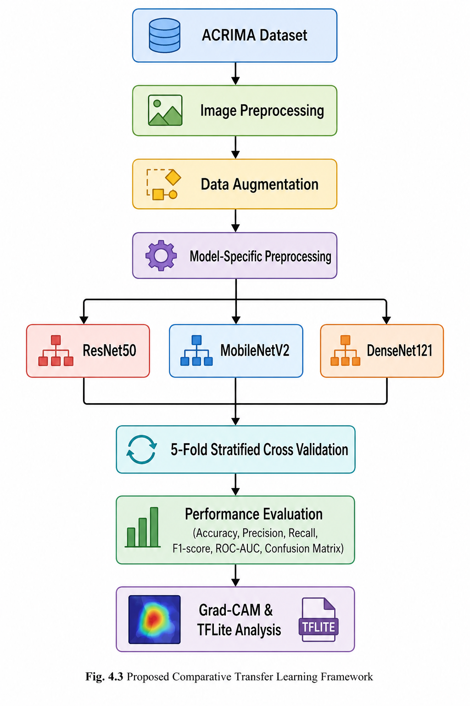

### Data Preprocessing & Augmentation

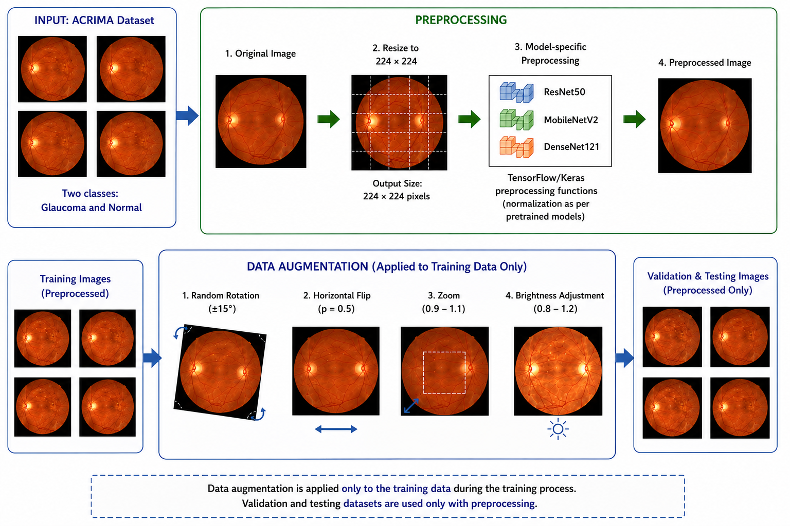

### DenseNet121

| ROC Curve | Confusion Matrix |
|-----------|------------------|
| 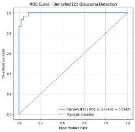 | 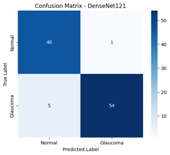 |

### ResNet50

| ROC Curve | Confusion Matrix |
|-----------|------------------|
| 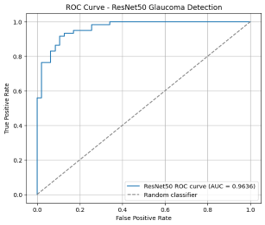 | 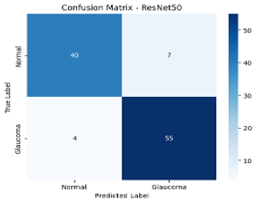 |

### MobileNetV2

| ROC Curve | Confusion Matrix |
|-----------|------------------|
| 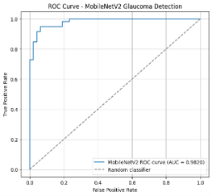 | 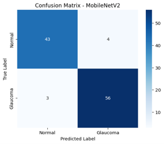 |

### Grad-CAM Visualizations

| DenseNet121 | ResNet50 | MobileNetV2 |
|-------------|----------|-------------|
| 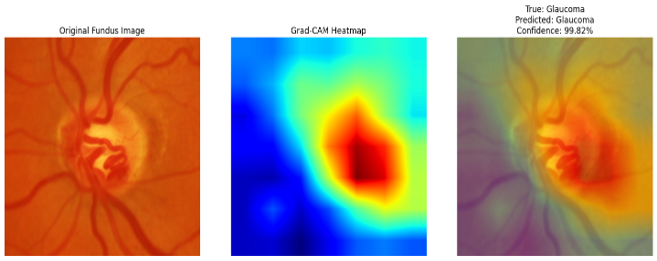 | 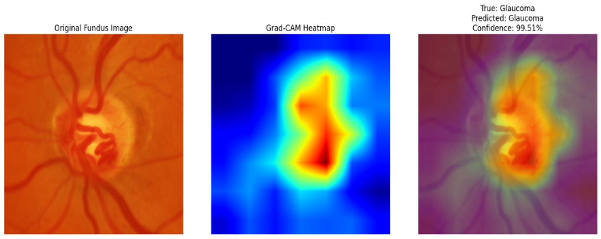 | 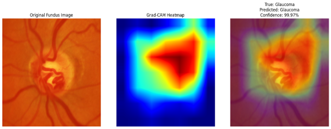 |

---

## Repository Structure

```text
comparative-glaucoma-detection/
│
├── notebooks/
│   ├── DenseNet121_Glaucoma_Detection.ipynb
│   ├── ResNet50_Glaucoma_Detection.ipynb
│   └── MobileNetV2_Glaucoma_Detection.ipynb
│
├── docs/
│   ├── report.docx
│   └── Glaucoma_Detection.pptx
│
├── images/
│
├── results/
│
├── requirements.txt
├── LICENSE
├── README.md
└── .gitignore
```
---

## Installation

Clone the repository:

```bash
git clone https://github.com/krishnavamsi-nitw/comparative-glaucoma-detection.git
cd comparative-glaucoma-detection
```

Install the required dependencies:

```bash
pip install -r requirements.txt
```

---

## Running the Project

1. Download the **ACRIMA** dataset from its official source.
2. Place the dataset in the following directory:

```text
dataset/
└── Images/
```

3. Open any notebook from the `notebooks/` directory.

4. Run all cells sequentially.

---

## Explainable AI

This project uses **Grad-CAM (Gradient-weighted Class Activation Mapping)** to visualize the image regions influencing model predictions.

Grad-CAM improves model interpretability by highlighting clinically relevant retinal regions, making the decision-making process more transparent.

---

## TensorFlow Lite Deployment

The MobileNetV2 model is converted to **TensorFlow Lite (TFLite)** format to evaluate its suitability for deployment on resource-constrained devices such as smartphones and embedded systems.

---

## Future Work

Possible future improvements include:

- EfficientNet-based architectures
- Vision Transformers (ViT)
- ConvNeXt
- Multi-dataset evaluation
- Model quantization
- Model pruning
- Real-time mobile deployment
- Clinical validation using larger datasets
---

## References

- ACRIMA: Automatic Retinal Image Analysis Dataset
- TensorFlow
- Keras
- Scikit-learn
- Grad-CAM: Gradient-weighted Class Activation Mapping

---

## Acknowledgements

This research project was carried out under the guidance of **Prof. V. Rama**, Department of Electronics and Communication Engineering, National Institute of Technology Warangal.

We sincerely thank our faculty mentor for continuous guidance and support throughout the project.

---

## Authors

This repository showcases the collaborative work completed by:

- V. Krishna Vamsi
- P. Vignannavadeepak
- N. Kushav Reddy

---

## License

This project is licensed under the **MIT License**. See the `LICENSE` file for details.